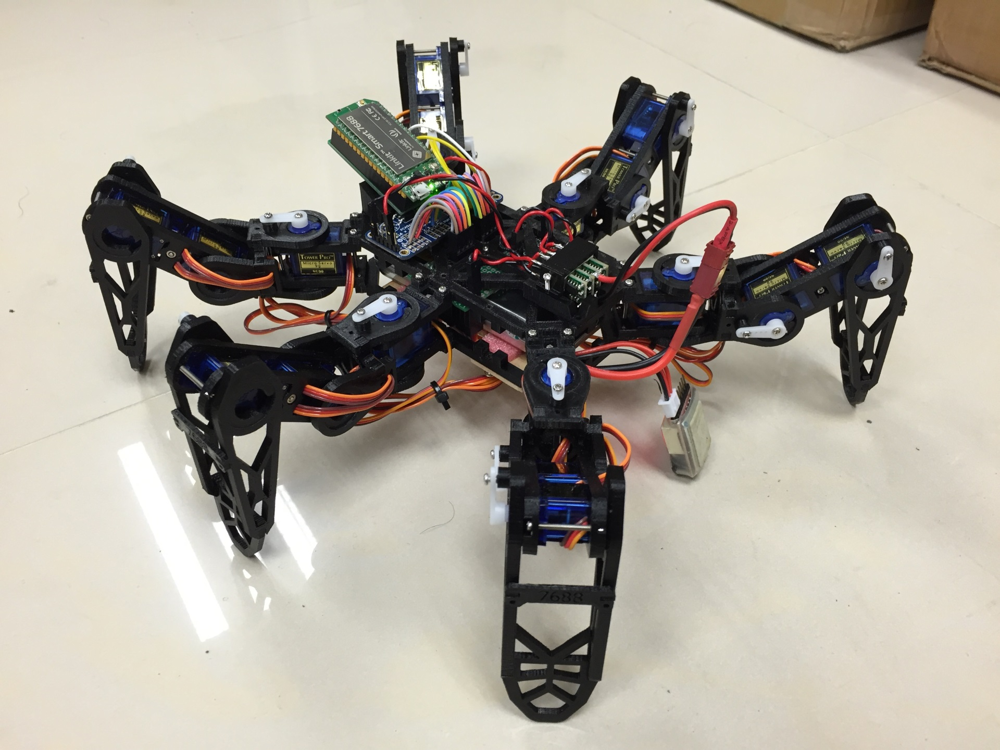

# An 18 DOF Hexapod project using LinkIt Smart 7688 + PCA9685

[Youtube video](https://www.youtube.com/watch?v=CbFrT2eCAvw)

## Hardware

* Body: 3D printed, go to [STL](STL) folder
* [LinkIt Smart 7688](labs.mediatek.com/7688)
* [Adafruit 16-channel PWM driver (PCA9685)](https://www.adafruit.com/product/815)
* SG-90 mini servo x 18
* DC/DC Buck Voltage regulator (Mini 360 from Taobao/[Amazon](http://www.amazon.com/4-75-23V-1-17V-DC-DC-Converter-Module/dp/B00NJCAI7G))
* 2-cell LiPo battery

### Electronics

There are 18 servo controlled by 18 PWM channel, 2 of them are from 7688 itself (GPIO18 & GPIO19), the rest are from the PWM driver connected to 7688 via I2C interface

And 4 DC/DC buck voltage regulator are used because servo draw lots of amount of current (500mA each, 9A total). Each of them provide *3A* current and serve 6 servos (2 legs)
Voltage regulator 1~3 serves all 18 servos
Voltage regulator 4 serves 7688 and PCA9685 (PWM driver IC)

## Software

### hexapod.js

The files contains:
* Logic to control 18 servo via I2C or PWM0/1 (check function `writePwm`)
* IK (inverse kinematics) algorithm (check function `loc2angle`)
* Movement path table (check function `_dance` and array `_danceTable1`)
  * There are 3 path now:
    1. forward/backward waving ([youtube video](https://youtu.be/CbFrT2eCAvw?t=37))
    2. left/right waving ([youtube video](https://youtu.be/CbFrT2eCAvw?t=2))
    3. circle waving ([youtube video](https://youtu.be/CbFrT2eCAvw?t=11))
  * The path are pre-generated using another JS
* The main loop (check function `_next`)

